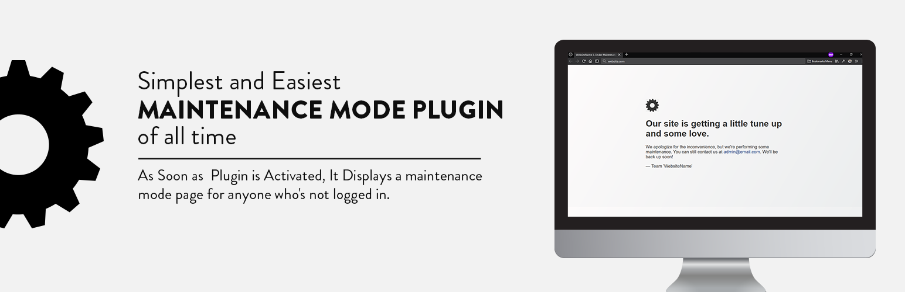

# DD Simplest Maintenance Mode Plugin

Display maintenance or Coming Soon Page for anyone who's not logged in for WordPress Blog.
The login page gets excluded so that you can log in if necessary.

# Features

- Simple & Free Maintenance and Coming Soon Page.
- Blog Name and Admin Email are shown on the Coming Soon Page
- Activate Plugin to Put Website/Blog on Maintenance and Deactivate to Disable
- Login URL (domain/wp-login.php) is Excluded and Also Logged in Users are Excluded from Maintenance
- No Data is Taken and Collected, This is a Free Plugin, No Paid Plans and No Charges to Use it.

# Leave Your Suggestions for Improvement

If You have any Type of Suggestions for the Plugin, You Can Submit them in the issues section.

# Reuse and Editing

If Anyone trying to use it and Customise it, They need to Credit the Author.

# Changelog

= 2.5 : 27th July, 2021
* Fixed: Allowed access to XML-RPC
* Fixed: WP-Cron Job not running while in maintenance

= 2.4 : 4th February, 2021 =
* Added: Backend access to other users who can edit posts (authors, editors, contributors etc
* Added: Admin notice for other users about maintenance mode
* Fixed: responsiveness Design
* update: added support for the latest WordPress versions

= 2.1 : 31st August, 2020 =
* Few Optimizations in Design & Plugin Files

= 2.0 : 31st August, 2020 =
* More Clean Design, Cleaner & Less Amount of Code, Reduced Page Size

= 1.0 =
* First Release of Plugin.

# Installation

1. Upload the plugin folder (dd-maintenance-mode) to the `/wp-content/plugins directory, or install the plugin through the WordPress plugins screen directly.

2. Only Activate the plugin to Enable the Maintenance Mode on Your Website through the 'Plugins' screen in WordPress

# Frequently Asked Questions

**1. Is DD Simplest Maintenance Mode Plugin Free?**

> Yes, This Maintenance & Comming Soon Plugin is Absolutely Free Forever.

**2. Are There any Paid Plans?**

> NO, It is 100% Free, But You Can Make Donations to Support the Plugin Author
